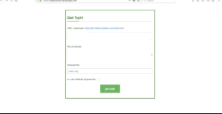

# topn  

application to scrape any website and get top N (here N is input) high frequent words from site.
Also has functionality to neglect stop words from results.
Note: Result is in lowercase

## Plugin Used:

#### Frontend:

    JQuery    
    angularJS  
    ngTagInput  

#### Backend:

    NodeJS  
    expressJS  
    Logger: morgan  
    View engine: ejs  

#### linting Tool:

    jshint (AIRBNB standards)

#### dependencies:  

    nodeJS  
    NPM

#### Directories:

	bin 	       // run app
	public 	       // static directory
	routes 	
        index.js   // app routing and API's
    scripts 
        top-n.js   // Algorithm for find topn words and removing stopwords.
	views 	       // FRONTEND Views
	.jshintrc 	   // for JS lint(Airbnb standard)
	README.md 	
	app.js 	       // main app
 	bower.json 	 	
    package-lock.json 	
	package.json
## steps to build:  

application is preconfigured you just need to install dependencies. And then  

    npm start

## API's:  

*URL: /api/v1/topn*  

API to get top N elements from URL:

Request:  
```
  {
    METHOD: 'POST',
    URL: '/api/v1/topn',
    HEADER: {content-type: application/json}
    data: {
      URL: <String> url to scrape data from
      n: <Number> N for resultant
      stopwords: <Array<String>> words to be neglected
    }
  }
```
Response:  
```
  {
    status: 200(success)/500(fail)
    data: {
      status: <String(success/fail)>,
      data: <Object> of type: {<Number>frequency: [<String>, <String>] words }
    }
  }
```
#### DEMO CALL API:  

*Success case example*: 
REQUEST:

```
{
    METHOD: 'POST',
    URL: '/api/v1/topn',
    HEADER: {content-type: application/json}
    data: {
      URL: 'http://terriblytinytales.com/test.txt'
      n: 12
      stopwords: ['this', 'ttt']
    }
  }
```

RESPONSE:
```
{
"status":"success",
"data":{"12":["us"],"13":["of"],"15":["the","at"],"16":["and"],"18":["can"],"21":["you"],"23":["to"],"24":["a"],"27":["i"]}
}
```

## DEMO USAGE FRONTEND APP  


